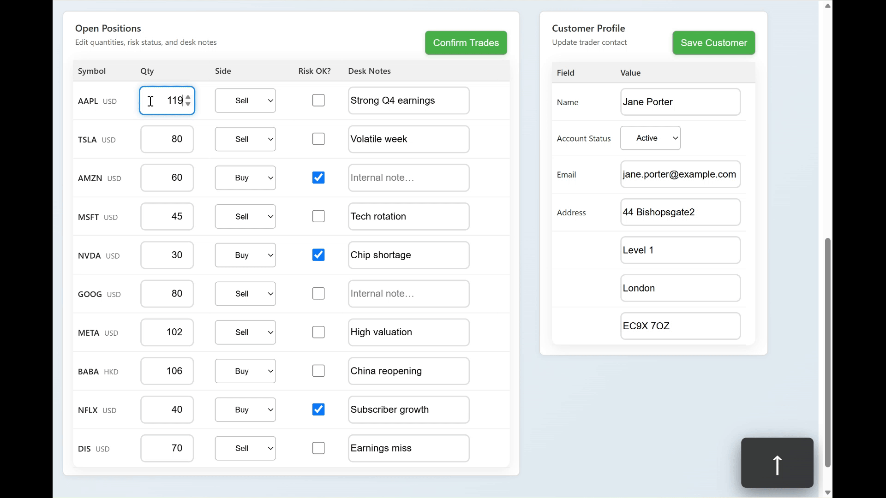

# 🎯 Focusly – Intuitive, Elegant Keyboard Navigation for Angular

**Focusly** is a lightweight Angular library that brings **intuitive, keyboard-driven navigation** to web applications.

It lets users move effortlessly between interactive elements—inputs, dropdowns, buttons, or any focusable control—using familiar keys like **↑ ↓ ← →**, **Home**, **End**, and **Page Up / Page Down**.

Each *Focusly Group* acts as an independent navigation zone, so multiple grids or forms on the same page can be navigated separately and respond logically to user intent.

It provides an elegant way to define how users move between interactive controls — such as text boxes, dropdowns, or buttons — using keyboard shortcuts.  
Focusly was designed to make keyboard navigation **predictable, accessible, and fast**, even in complex data entry UIs.

---

## ✨ Features

- 🚀 Navigate grids, tables, or forms entirely via keyboard 
- 🎯 **Scoped focus groups** so each panel or table behaves independently on a single page
- 🪄 Elegant and simple declarative API using Angular directives  
- 🧩 Works with any focusable element (`<input>`, `<select>`, `<button>`, etc.)  
- 🧠 Easily extendable to custom components 
- ♿ Built for accessibility and developer simplicity
- ⚡ Built with Angular **signals** for instant reactivity — no manual change detection
- 🔄 Fully reactive and framework-native (no DOM listeners or external deps)
- 🪶 Small, simple, and zero-dependency

---

## 🧠 Concept

Each focusable element declares:
- A **group** – to separate independent navigation contexts (e.g., two tables)
- A **row** and **column** – to describe its position within that group

Focusly tracks the user’s current focus position and responds to keyboard events to move to the appropriate neighbour.

---

## 📦 Installation

```bash
npm install focusly
```

## ⚡ Keyboard Navigation in Action

Experience **Focusly** in motion — navigate complex Angular tables and forms using only your keyboard.  
Use **Alt + Arrow Keys** to move focus, and **Enter** to trigger contextual actions.

<p align="center">
  
</p>
