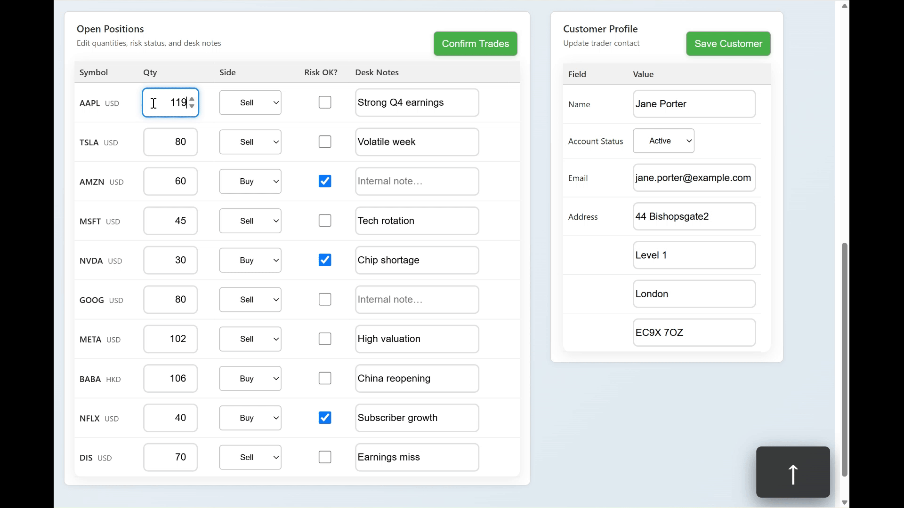

# 🧩 Focusly

Focusly is a lightweight **keyboard-navigation framework for Angular** that lets users move seamlessly between complex, data-heavy UI elements using only the keyboard.

It’s designed for **grids, forms, and dashboards**, where fast keyboard movement between inputs, selects, and buttons is essential.

---

## ✨ Features

- 🚀 Navigate between inputs, selects, buttons, and checkboxes with **Alt + Arrow Keys**
- 🎯 **Scoped focus groups** so each panel or table behaves independently
- ⚡ Built with Angular **signals** for instant reactivity — no manual change detection
- 🧠 Easily extendable to custom components
- 🔄 Fully reactive and framework-native (no DOM listeners or external deps)
- 🪶 Small, simple, and zero-dependency

---

## 📦 Installation

```bash
npm install @zaybu/focusly
```


## ⚡ Keyboard Navigation in Action

Experience **Focusly** in motion — navigate complex Angular tables and forms 
using only your keyboard.  
Use **Alt + Arrow Keys** to move focus, and **Enter** to trigger contextual actions, 
all handled reactively via Angular **signals**.

<p align="center">
  
</p>
